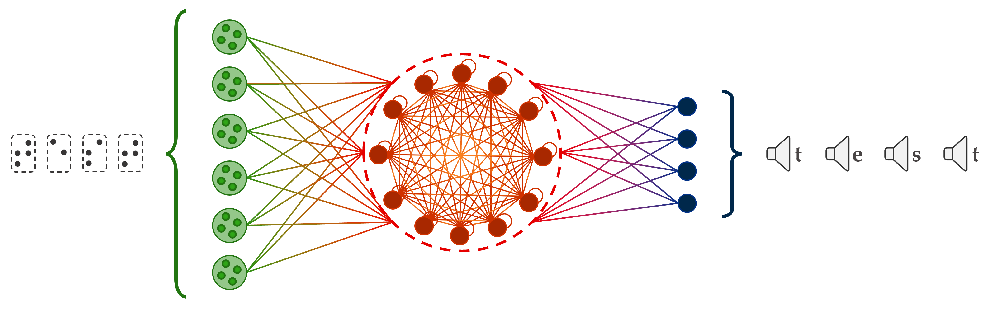

# **Neu-BrAuER**: **Neu**romorphic **Br**aille **Au**dio-**E**nhanced **R**eader

This project proposes an application of Braille letter reading showing a neuromorphic audio-reader for edge devices.\
Given the recordings acquired through an artificial fingertip and collected in a [dataset](https://zenodo.org/record/7050094) (with different spike-encoding strategies also), a spiking neural network (SNN) similar to the one employed in the [original Braille reading paper](https://www.frontiersin.org/articles/10.3389/fnins.2022.951164/full) is designed for classification of raw signals. Specifically, Neu-BrAuER is equipped with an encoding layer which allows the model to directly work with continuous signals thanks to the neuron populations of the first layer which are in charge of performing the signal-to-spike conversion.\
Details can be found in the following paper: V. Fra et al.; "Neu-BrAuER: a neuromorphic Braille letters audio-reader for commercial edge devices"; ECML-PKDD 2023, DLNH Workshop; *in press*

\
Neu-BrAuER is based on a three-layer SNN made of leaky integrate-and.fire (LIF) neurons. It receives continuous signals from pressure sensors sliding on Braille characters as input and gives the classified letters as output by pronouncing it.\
A schematic of its functioning is shown below:
\


\
To reproduce the results of the above mentioned paper, you can use the `inference_v0.py` script after downloading the needed pre-trained ONNX model from [Zenodo](https://zenodo.org/record/8435172).

\
If you use, or refer to, these results, please cite:
```
@software{NeuBrAuERv02023,
  author       =    {Fra, Vittorio},
  title        =    {Neu-BrAuER (v0)},
  month        =    sep,
  year         =    2023,
  publisher    =    {Zenodo},
  doi          =    {10.5281/zenodo.8435172},
  url          =    {https://zenodo.org/records/8435172}
}

@article{Fra2023NeuBrAuER,
    author      =   {Fra, Vittorio and Pignata, Andrea and Pignari, Riccardo and Macii, Enrico and Urgese, Gianvito},
    doi         =   {},
    publisher   =   {Springer}
    journal     =   {Communications in Computer and Information Science},
    title       =   {Neu-BrAuER: a neuromorphic Braille letters audio-reader for commercial edge devices},
    volume      =   {},
    year        =   {in press}
}
```   

\
For newer versions of Neu-BrAuER, you can instead use the `Neu-BrAuER_inference.py` script with the desired pre-trained ONNX model from [Zenodo](https://zenodo.org/records/10000162).
\
In this case, please cite:
```
@software{NeuBrAuER2023,
  author       =    {Fra, Vittorio},
  title        =    {Neu-BrAuER},
  month        =    oct,
  year         =    2023,
  publisher    =    {Zenodo},
  doi          =    {10.5281/zenodo.10000161},
  url          =    {https://zenodo.org/records/10000162}
}
```
<br/><br/>
## Results history <sup>(test accuracy)</sup>: 
- v0 &ensp;&ensp;&ensp; &rarr; &ensp; 73.52% 
- v1.0 &ensp;&nbsp; &rarr; &ensp; 87.78%